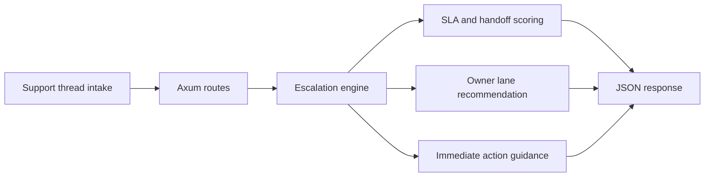

# Support Escalation Router

Support Escalation Router is a Rust and Axum backend for converting support queue pressure into clear ownership, SLA-aware escalation, and incident handoff guidance. It treats support routing as an operating system concern instead of leaving it buried in disconnected ticket queues.

## Portfolio Takeaway

- Rust backend with operator-facing escalation logic
- queue, SLA, and handoff pressure turned into concrete routing decisions
- practical JSON API with docs, tests, CI, and real proof assets

## Overview

| Area | Details |
| --- | --- |
| Language | Rust |
| Framework | Axum |
| Runtime Shape | HTTP service with in-memory escalation threads |
| Routes | `/`, `/docs`, `/api/dashboard/summary`, `/api/tickets`, `/api/tickets/{id}`, `/api/sample`, `/api/analyze/route` |
| Focus | Support queue escalation, SLA pressure scoring, owner routing, incident handoff planning |
| Validation | `cargo test`, `cargo build`, `cargo run`, `cargo run -- --help` |

## What It Does

- models support threads with queue pressure, callback risk, and handoff count
- scores each payload into `stable`, `watch`, or `escalate`
- recommends the correct owner lane and immediate action
- exposes a JSON API that can feed dashboards, runbooks, or escalation consoles

## Architecture



Additional detail lives in [docs/architecture.md](./docs/architecture.md).

## API

### `GET /`
Returns service metadata and route discovery.

### `GET /docs`
Returns a lightweight HTML operator guide.

### `GET /api/dashboard/summary`
Returns live queue posture and aggregate escalation pressure.

### `GET /api/tickets`
Returns modeled support threads.

### `GET /api/tickets/{id}`
Returns a single ticket thread.

### `GET /api/sample`
Returns a sample route analysis.

### `POST /api/analyze/route`
Scores a payload and returns the next action.

Example payload:

```json
{
  "id": "sup-9401",
  "title": "Premier customer cannot export invoices before close",
  "queue": "enterprise-support",
  "severity": "critical",
  "customer_tier": "enterprise",
  "region": "us-east",
  "sla_minutes_remaining": 14,
  "unresolved_dependencies": 3,
  "owner_lane": "billing-platform",
  "handoff_count": 4,
  "callback_risk": "high",
  "blockers": [
    "Freeze window closes in under 20 minutes",
    "Current notes are split between support and finance operations"
  ],
  "next_steps": [
    "Assign incident command",
    "Pause nonessential callback traffic"
  ]
}
```

## Screenshots

### Hero


### Queue Lanes


### Escalation Detail


### Validation Proof


## Local Run

```powershell
cd support-escalation-router
$env:Path = "$env:USERPROFILE\.cargo\bin;$env:Path"
cargo run
```

Then open:

- `http://127.0.0.1:4384/`
- `http://127.0.0.1:4384/docs`

If that port is already occupied, choose another one before running:

```powershell
$env:PORT = "4390"
cargo run
```

## Validation

```powershell
cd support-escalation-router
$env:Path = "$env:USERPROFILE\.cargo\bin;$env:Path"
cargo test
cargo build
cargo run
```

## Tech Stack

[](https://www.rust-lang.org/)
[](https://github.com/tokio-rs/axum)
[](https://tokio.rs/)

## Portfolio Links

- [Kinetic Gain](https://kineticgain.com/)
- [LinkedIn](https://www.linkedin.com/in/mirzacausevic)
- [GitHub](https://github.com/mizcausevic-dev)
- [Skills Page](https://mizcausevic.com/skills/)
